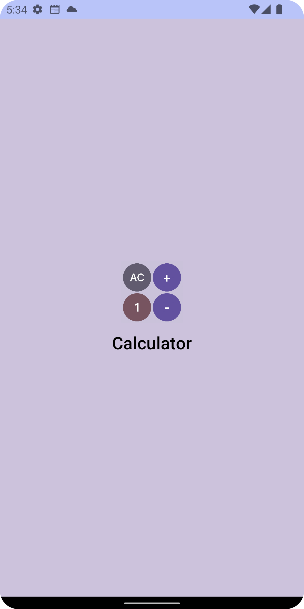
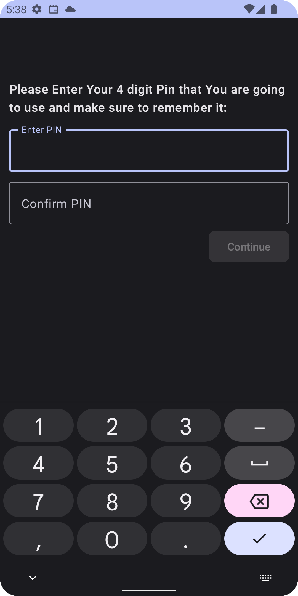
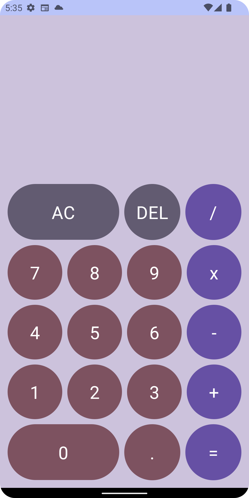
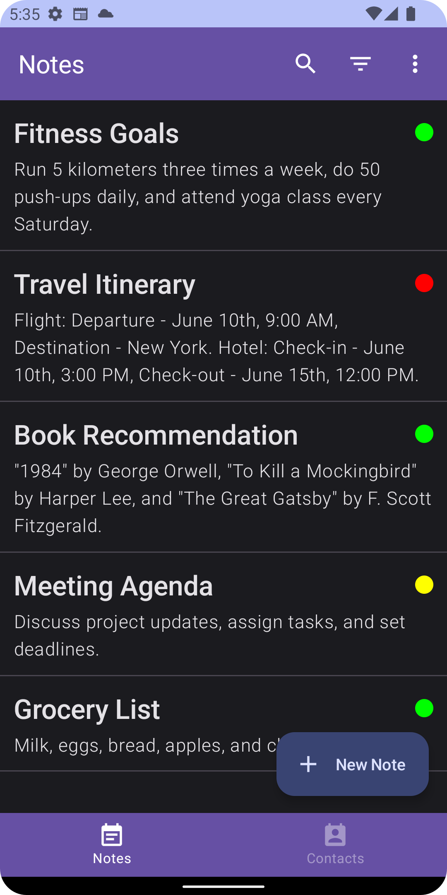
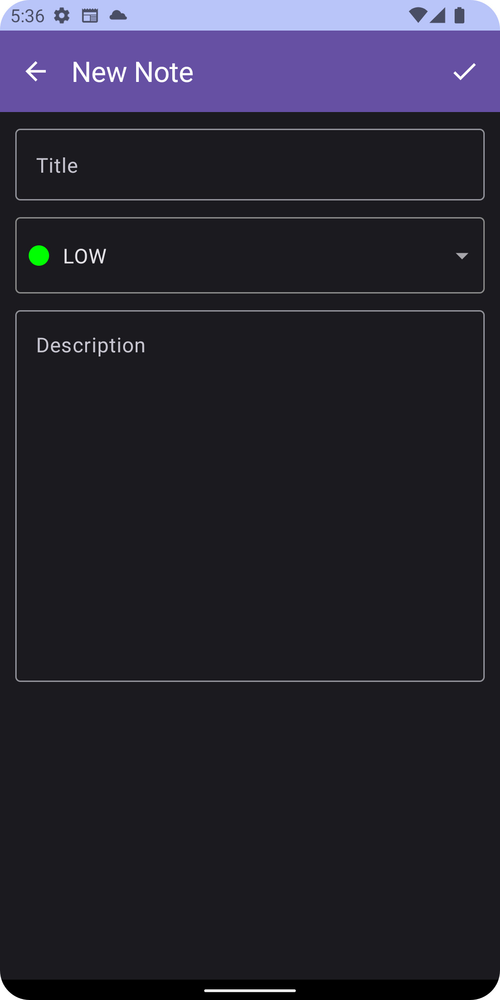
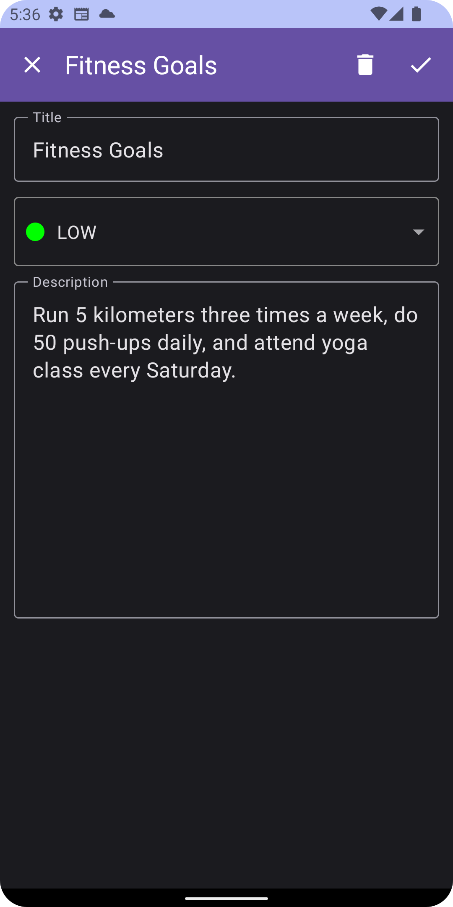
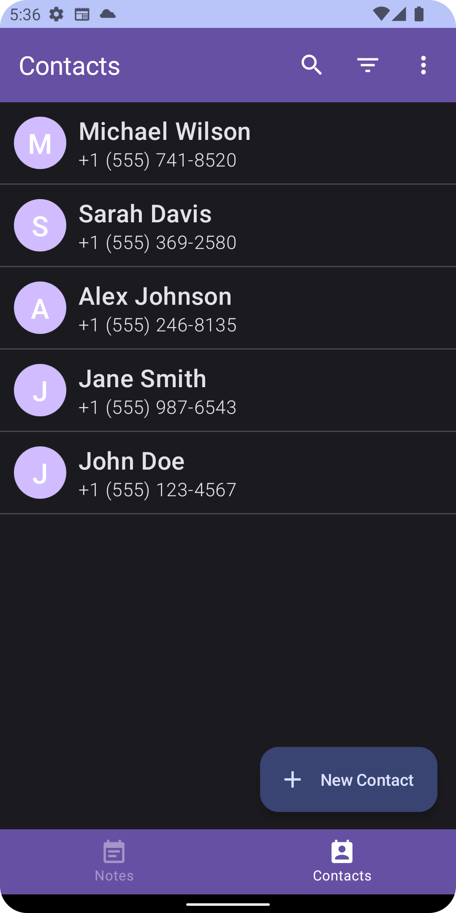
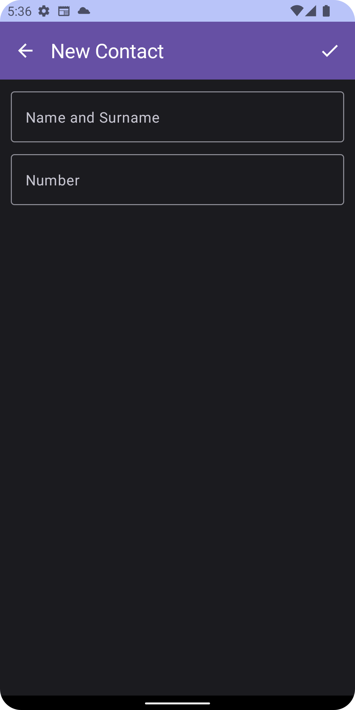
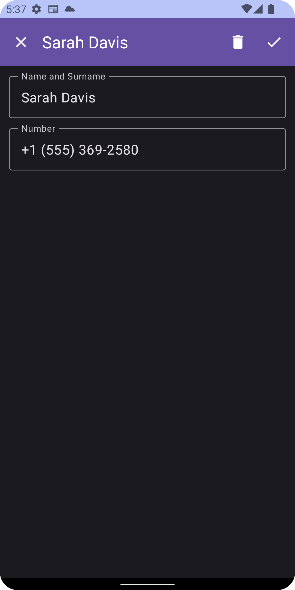

# SecretVault Android App

Android App built with Kotlin that acts like a Calculator but upon entrance of correct pin and pressing the equal (=) sign, presents a new "vault" screen where You can add new notes contacts as well as contacts.

## Screenshots of the app:
| Splash Screen                                           | Pin Screen                                                 | Calculator Screen                                               |
|---------------------------------------------------------|------------------------------------------------------------|-----------------------------------------------------------------|
|    |          |        |
| 
**Notes Screen**                                | 
**New Note Screen**                                | 
**Existing Note Screen**                                |
|     |     |     |
| 
**Contacts Screen**                             | 
**New Contact Screen**                             | 
**Existing Contact Screen**                             |
|  |  |  |

## How to run the app
- Download the source code 
- Make sure that your Android Studio is up to date
- Open the project in Android Studio
- Run and enjoy the app